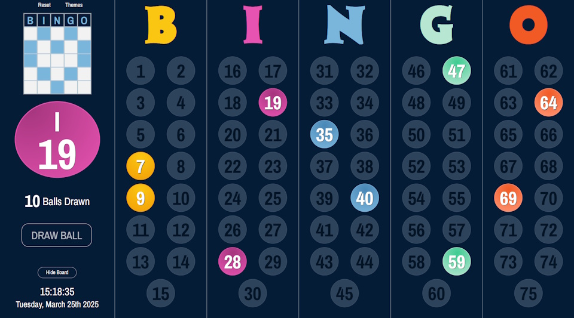

Bingo Display Board for hosting BINGO games.
* Randomly draw and project BINGO balls
* Manually select balls if you're drawing physical balls in person
* Display the count of balls drawn/remaining
* Set a winning pattern
* Change the look of the board with dark, light and brand color themes
* Now displaying current time and date

Bingo Master Board is designed for full screen view in a computer browser and supports the latest versions of most modern browsers.
###### (not desinged for mobile device browsers)

## License
Bingo Master Board is licensed under the MIT License.
